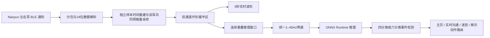

# BCI 扫描输入法

面向耳电（Ear-EEG）脑机接口的 Android 扫描交互原型。项目将双耳 BLE 数据采集、实时波形、ONNX 推理、T9 拼音扫描、上下文预测、迷宫控制，以及个性化数据上传训练整合在一个应用中。

当前应用以独立 `Activity` 运行，尚未声明 Android 系统级 `InputMethodService`，因此它是扫描输入交互原型，而不是可在其他 App 中直接调用的系统键盘。

仓库地址：[WoodenCatter/special_input_method](https://github.com/WoodenCatter/special_input_method)

## 主要功能

- 首页集中提供设置、实时沟通、迷宫游戏和娱乐四个模块，并直接展示设备、电量、佩戴状态与实时信号。
- T9 字母块扫描：`ABC`、`DEF`、`GHI`、`JKL`、`MNO`、`PQRS`、`TUV`、`WXYZ`。
- 拼音组合、候选汉字、常用语、预测词和开场句分页扫描。
- 本地词典优先出结果，Rime 与可选远程 LLM 再异步补充；远程不可用时自动保持本地能力。
- 左看、右看、咬牙三种基础控制信号；六分类模型还支持“左右”和“右左”组合动作。
- 娱乐模块包含音乐与电视：音乐播放开放许可曲目，电视按选台结果动态解析央视网直播地址。
- 娱乐媒体网络栈优先使用 Android 系统 DNS；仅在系统解析抛出 `UnknownHostException` 时，使用带固定引导 IP 的阿里公共 DoH 解析后重试。
- Naoyun 双耳 BLE 设备扫描、连接、数据流初始化、静默断流检测与分级自动恢复。
- 500 Hz 双通道耳电接收、共同时间轴双侧重采样、丢包重同步和诊断日志。
- 双通道 5 秒实时波形，固定量程 `-200～200 µV`。
- 绘图、推理和训练合同统一使用 `1–45 Hz` 带通，不随模型切换。
- ONNX Runtime 端侧推理，支持个性化下载模型和内置回退模型。
- 四分类/六分类异步事件控制使用固定 `100 ms` 步长、5 窗时间证据、Session 物理门控、单次锁定和连续 Rest 解锁。
- 每次异步控制运行都会记录窗口概率、检测状态和耗时；真正触发动作的事件还会保存对应原始双通道 `.npy` 窗口，供离线诊断。
- 分本地用户的连续 NPZ 采集、自动上传、服务器训练、ONNX 下载与启用。
- 设置页当前每次采集选择一个服务端训练模型；底层 Session 与上传协议仍支持同一数据集关联多个模型任务，并会在存在多个有效结果时启用验证准确率最高者。

## 系统链路



## 应用模块

| 模块 | 当前状态 | 说明 |
|---|---|---|
| 设置 | 可用 | 扫描速度、用户、设备采集、服务端绑定、训练任务和模型管理 |
| 实时沟通 | 可用 | T9 拼音扫描、汉字选择、常用语、开场句与上下文续写 |
| 迷宫游戏 | 可用 | 四分类控制移动；六分类额外用组合动作清除两类障碍 |
| 娱乐 | 可用 | 音乐播放、歌单选择，以及 CCTV-1～CCTV-5 动态直播；触屏和四分类基础动作均可控制 |

首页会自动请求所需权限、扫描名称匹配 `Naoyun Pods BLE` 的设备，并在连接后展示左右耳电量、佩戴状态和实时双通道波形。触屏可进入全部模块；BCI 在首页通过左看/右看循环选择，通过咬牙确认，但设置模块有意禁止 BCI 误进入。

## 输入交互

应用默认扫描周期为 `1500 ms`，可在设置页调整为 `1100～3000 ms`，并持久化到本机。该参数只控制候选项的高亮停留时间，不改变异步 EEG 推理的窗口长度或步长。

| 阶段 | 左看 | 右看 | 咬牙 |
|---|---|---|---|
| 一级字母块 | 切到左侧，或选择左侧当前块 | 切到右侧，或选择右侧当前块 | 有拼音输入时进入拼音组合；否则进入常用语选择 |
| 拼音组合 | 高亮方向改为向左 | 高亮方向改为向右 | 确认当前拼音并进入候选字 |
| 候选字 | 高亮方向改为向左 | 高亮方向改为向右 | 确认当前汉字 |
| 预测词 | 高亮方向改为向左 | 高亮方向改为向右 | 确认当前预测词 |

选择汉字后，界面先展示用户历史与本地语言模型候选，再并行追加 Rime 和经过身份认证的远程上下文候选；首句输入还支持按 T9 块序列查询本地开场句索引并由远程服务补充。候选采用稳定追加和去重，扫描开始后已有项不会因慢响应重排。未配置服务器凭据、超时或网络失败都只会触发本地回退。Debug 构建会在 ViewModel 中生成短暂的预测链路诊断状态，但当前实时沟通页面尚未挂载诊断浮层。

## BCI 设备与数据

当前 BLE 协议针对设备名匹配 `Naoyun Pods BLE` 的双耳设备：

- 采样率：`500 Hz`。
- 每耳每包：`50` 个采样点。
- 理想速率：每耳约 `10 包/秒`。
- 数据通道：左耳、右耳。
- 数据精度：设备 24 位原始值转换为手机端浮点物理量。
- 包计数：无符号 8 位循环计数。

左右耳通知独立到达。`EegStereoPacketAligner` 分别保存两耳的原始样本索引和包尾单调时钟锚点，并在最近 10 秒锚点上持续拟合两套独立的仿射采样时钟；斜率就是该耳的实际采样率，因而可以跟踪长时间晶振漂移。一个 BLE 回调若含多个包，会以最新包结束于回调时刻、旧包按包长向前展开，而且仍按包计数的先后顺序入队。绘图、推理和采集取窗时，才取两耳共同覆盖范围并把两侧都线性重采样到同一个 2 ms 目标网格；不存在一条一经生成便永久不再修正的“已对齐流”。8 位包计数只在每耳内部检查回绕、重复、乱序和丢包；任一耳计数丢包会清空本轮插值历史并开启新数据 epoch，采集时只废弃并重采受影响的当前动作，不终止整个 Session。

应用每 `250 ms` 检查左耳、右耳和双耳共同进度的新鲜度：超过 `1 秒` 标记延迟，超过 `1.5 秒` 判定数据流中断。如果左右耳各自仍持续到达，只在本地清理插值历史并重新拟合时钟模型，保持现有 GATT；只有某一耳本身也停止到达，才先重发 `OPEN_DATA`，`3 秒` 后仍未恢复再关闭旧 GATT 并重新连接。连接、服务发现和通知初始化最长等待 `10 秒`。单轮 BLE 恢复最多尝试 `3` 次；普通使用进入明确错误状态，正在采集时则每隔至少 `5 秒` 发起新一轮恢复，直到恢复或用户主动停止。

实时波形每 `50 ms` 按最新时钟模型重建完整的 5 秒双耳共同窗口，再执行与训练一致的窗口级 `1–45 Hz` 滤波。推理同样按最新共同窗口取定长数据；个性化采集则按提示音的单调时钟起点请求完整动作窗口。三条消费者链路共享同一个取窗接口，但不会共享一份已经冻结的旧对齐结果。

Android 12 及以上需要“附近的设备”权限；Android 11 及以下需要蓝牙和位置权限，部分系统还要求打开位置服务。

## 实时推理

耳电控制按固定 `100 ms` 采样时间栅格取严格定长窗口（500 Hz 下为 50 点）。BLE 数据成批到达时会从对齐历史补算尚未处理的固定步长窗口；若积压超过 5 个步长则跳过过旧窗口并清空时序证据，避免旧动作延迟执行。四分类和六分类共用 3/5 时间证据累积器：保存最近 5 个单窗投票，某个非 Rest 类至少得到 3 票，且只在这些支持窗上计算的平均置信度达到 `0.85` 时形成动作候选。命令发出后锁定，连续 3 个置信度至少 `0.85` 的 Rest 单窗重新解锁。

模型负责动作语义和左右类别。四分类差分活动量、六分类动作活动量/组合动作跨度只负责拒绝不可能的动作候选；极性符号和模板最高分不再改写模型的左右类别。物理门控不再逐窗清零模型概率，而是在时序候选形成后检查最近 5 窗中至少 2 窗存在对应活动证据，因此单个相位较差的窗口不会污染概率队列。六分类模板相关度继续写入诊断日志，供采集质量分析使用。应用页面使用的 `BciCommandGate` 只负责屏蔽或恢复命令投递，不参与类别判断。

推理使用 ONNX 元数据中的预处理契约、严格双通道点数和稳定 softmax。异步合同 v2 还声明 `evidence_mode=support_confidence` 和 `physical_support_required=2`。

四分类类别顺序固定为：

```text
0 = 静息
1 = 咬牙
2 = 左看
3 = 右看
```

六分类类别顺序固定为：

```text
0 = 静息
1 = 左看
2 = 右看
3 = 咬牙
4 = 左右
5 = 右左
```

每个采集 Session 会生成独立的 `async_calibration.json`。新异步 Trial 从前/后静息提取 Rest 校准窗，从任务区间提取动作校准窗；旧 marker Session 继续走原有兼容路径。六分类还保存组合动作活动量、跨度门槛和四路 64 点诊断模板。模型切换时只加载协议、标签顺序、模型窗口及训练 Session 全部匹配的校准文件。

异步运行日志位于应用内部存储的 `files/bci_async_runs/`：每次运行包含 `run.json`、`windows.jsonl`、`events.jsonl`，事件还保存对应原始双通道 `.npy` 窗口。

### ONNX 约束

应用支持以下输入形状：

```text
(1, 2, N)
(1, 1, 2, N)
```

个性化模型下载后会校验：

- `algorithm` 与所选模型一致；
- `sample_rate_hz = 500`；
- `channels = 2`；
- `input_points` 与采集动作时长一致；
- `label_names` 与所选协议的固定标签顺序完全一致；
- 预处理契约摘要一致；
- 输入适配器包含 `numpy-npz`；
- 可以完成一次零输入测试推理。

若没有有效的个性化活动模型，应用回退到 `app/src/main/assets/model.onnx`。

## 预处理

实时绘图、ONNX 推理、采集上传 metadata 和下载模型校验统一使用 `1–45 Hz`、二阶 Butterworth、窗口级零相位 `filtfilt`。选择 EEGNet、CSANet 等模型只改变训练算法，不改变预处理。旧 Session 中的 `csanet-original`、0.1–40 Hz 或 Z-score preset 读取时统一迁移为 1–45 Hz。

## 个性化采集与训练

### 用户与服务器绑定

- 本地用户可以离线创建，每个用户保存独立采集记录和模型。
- 一台设备绑定一组服务器账号，所有本地用户共用该绑定。
- 每位本地用户永久保存一个 `client_profile_id`；联网后通过幂等接口取得服务器 `profile_id`。
- 数据上传与训练任务都显式携带该 `profile_id`，后台任务会拒绝跨用户或跨 profile 上传。
- 服务器迁移产生的未关联历史 profile 会获得稳定的 `client_profile_id`，转为同名普通用户
  profile 并在 Pad 上恢复；例如历史 profile“辛”会恢复成可选择的本地用户“辛”。
- 应用重装后重新绑定同一服务器账号，会枚举服务器现有 profile，按原 `client_profile_id`
  重建本地用户，并恢复已经上传的数据集、训练记录和仍可下载的 ONNX 模型；恢复完成后
  自动启用验证准确率最高的可用模型。
- Android 卸载仍会删除应用私有目录和本机凭据。只有已经完成服务器上传的数据可以恢复；
  尚未上传成功的采集、开放中的流式分块以及纯本地设置无法在卸载后找回。
- 恢复旧 ONNX 时仍严格验证预处理契约。若旧模型使用现已移除的预处理选项，不会放宽校验
  强行启用；应用会下载对应原始 NPZ，上传一个声明当前统一 `1–45 Hz` 契约的新数据版本并
  自动重新训练。旧数据集、旧任务和旧模型继续保留在服务器作为历史记录。
- 批量恢复产生的待上传/重训练会话由单个后台任务依次处理；同一服务器账号的短期 Token
  在进程内共享并采用单次刷新，认证失败也有短暂冷却，避免多个 WorkManager 任务同时请求
  `/auth/token` 而触发网关限流。Nginx 的登录防护保持不变。
- 历史 marker 中的 `round=0` 表示旧版本没有记录轮次；重新上传时会省略该字段，保留其
  “未知轮次”语义并兼容当前服务端 `round >= 1` 契约。已经因此失败的本地会话会自动恢复为
  `PACKAGED` 并重新入队。网络、429、502、503 等临时失败由 WorkManager 线性退避重试；
  其余确定性 4xx 不会原样无限重发，而会保留错误等待契约修复或用户更正。
- API Key 使用 Android Keystore 的 AES-GCM 加密后保存在本机，不写入用户或会话 JSON。
- 默认服务地址为 `https://smu-brain.online`，定义在 `BrainApiClient.kt` 的 `BASE_URL`。

### 采集范式

四分类每轮采集以下非 Rest Trial，顺序随机：

```text
咬牙 / 左看 / 右看
```

六分类每轮采集：

```text
左看 / 右看 / 咬牙 / 左右 / 右左
```

每个 Trial 只包含一个动作，完整保存为：

```text
随机前静息
→ 播放提示音并记录 Ignore 区间
→ 执行动作
→ 随机后静息
```

提示区间与任何滑窗发生重叠时，该窗不会进入训练。前后静息均至少覆盖一个完整模型窗口：1 秒模型窗对应随机 `1～2 秒` 静息，2 秒模型窗对应随机 `2～2.5 秒` 静息。Rest 不再要求用户单独执行，而是从每个 Trial 的前后自然静息中产生。

参数范围：

- 采集轮次：`4～100`；每轮每个非 Rest 类各一个完整 Trial。
- 动作时长：`0.8～5.0 秒`；当前基线同时作为模型窗口长度，但在数据协议中独立记录。
- 训练轮次（epochs）：`1～50`，默认 `50`。
- 模型选择只决定训练算法，预处理固定为 1–45 Hz。

正式开始前，应用分别统计两耳原始样本增量，并检查是否能生成共同时间窗：连续两个 1 秒检测窗达到 `450～550 Hz` 才放行；异常时持续等待恢复或由用户主动停止。

完整 Trial 结束时必须在同一个数据 epoch 内取得前静息、提示、动作和后静息的全部双耳共同覆盖。任一耳丢包、重连、写入队列溢出或对齐失败都会废弃并重采整个 Trial。有效 Trial 完成后才一次性进入文件和流式分块队列，已经判定无效的 Trial 不会提前上传。

服务器按模型窗口滑动切片。默认 1 秒窗口时：

```text
窗口 = 500 点
步长 = 50 点（100 ms）
动作覆盖至少 334 点 → 动作标签
动作覆盖为 0 → Rest
动作覆盖介于两者之间 → Ignore
与提示区间有任何重叠 → Ignore
```

服务器先按完整 Trial 划分训练、验证和测试集合，再在各集合内部切窗；同一 Trial 的高度重叠窗口不会跨集合泄漏。每个非 Rest 类至少需要 4 个 Trial。旧 marker 数据仍可训练，但不会伪装成新异步 Trial 数据。

前后静息比动作区间长，所以完整时间线自然会生成更多 Rest 窗；它们保留用于学习佩戴漂移、噪声和动作间静息，而不是简单删除。训练时根据训练集类别频率加权交叉熵：Rest 合计占损失的 50%，全部动作类合计占另外 50%，动作部分再由各动作类均分。这既防止 Rest 主导模型，也保留控制场景中静息显著多于单个动作的真实先验，并校正采样时间栅格造成的少量动作类数量差。独立测试 Trial 通过同一 3/5 支持窗规则做异步回放；`async_trial_accuracy` 及漏触发、错触发等指标只用于诊断，不再阻止训练完成、模型保存或客户端下载。

采集文件写入仍由独立 IO 协程完成，BLE 通知线程不执行文件 IO。5 秒流式分块格式、SHA-256、断点续传和失败重试保持不变；完整 Trial 会使上传数据量增加，但不改变传输机制。

### 上传与训练

采集结果保存为连续双通道 NPZ：

```text
continuous.npz
├── left.npy
└── right.npy
```

Trial 区间、任务区间、Ignore 区间、marker 兼容锚点、采样率、标签、模型窗口、100 ms 步长、2/3 覆盖率及时间证据参数保存在会话 JSON 与上传 metadata 中。WorkManager 在有网络时自动完成：

```text
采集时每5秒封装双耳原子分块 → 在线并行上传
→ 采集结束补传缺块并finalize（旧服务器自动回退完整NPZ）
→ 创建训练任务 → 轮询训练状态
→ 下载ONNX → 本地校验 → 保存模型 → 自动启用最佳模型
```

每个分块先持久化到 Session 目录，再由独立网络协程上传；断网不会阻塞 BLE 或丢失采集数据。服务端通过分块序号、起始采样点、双耳点数和 SHA-256 幂等确认，Trial 标注和兼容 marker 只在 finalize 时提交。旧流式 Session 和旧 marker 上传继续兼容。服务器端接口定义见 [`docs/SERVER_STREAMING_UPLOAD_GUIDE.md`](docs/SERVER_STREAMING_UPLOAD_GUIDE.md)。

服务端协议允许 `wheelchair-eegnet`、`csanet` 等多个训练任务引用同一个 finalized dataset/version，Session 也能保存多个模型运行结果。当前 Android 设置页每次采集只单选一个模型；恢复的历史 Session 或其他兼容流程若包含多个成功结果，应用会自动启用验证准确率最高且验证通过的模型，也可以在记录页手动切换。

模型管理支持删除成功或失败记录。删除操作只影响本地 ONNX、校验文件和关联采集数据，不删除服务器端数据或模型。

## 快速开始

### 环境要求

- Android Studio，建议使用其内置 JDK 17 或更高版本。
- Android SDK 36.1；最低支持 Android 7.0（API 24）。
- 支持 BLE 的 Android 设备。
- 如需 BCI：兼容当前 UUID 和数据格式的 Naoyun 双耳设备。
- 如需个性化训练：可访问配置的训练服务器并准备有效账号。

### 构建

Windows：

```powershell
.\gradlew.bat assembleDebug
.\gradlew.bat testDebugUnitTest
```

macOS / Linux：

```bash
./gradlew assembleDebug
./gradlew testDebugUnitTest
```

Debug APK 输出：

```text
app/build/outputs/apk/debug/app-debug.apk
```

使用 ADB 安装：

```powershell
adb install -r app\build\outputs\apk\debug\app-debug.apk
```

也可以直接在 Android Studio 中选择物理设备并运行 `app` 配置。

### 基本使用

1. 启动应用并授予蓝牙权限；首页会自动扫描 `Naoyun Pods BLE`，也可直接点选发现的设备。
2. 连接成功后确认左右耳电量、佩戴状态和波形持续更新；应用会自动加载匹配模型并启动异步控制。
3. 在首页触屏选择“设置”“实时沟通”“迷宫游戏”或“娱乐”；也可用左看/右看循环选择，用咬牙进入实时沟通、迷宫或娱乐。
4. 在“实时沟通”中用扫描方式组合拼音、选择汉字，并从常用语、开场句或上下文预测中继续输入。
5. 在“迷宫游戏”中用咬牙向上、左看向左、右看向右；六分类模型还能以“左右”和“右左”清除对应障碍。
6. 在“娱乐”中左右看循环高亮、咬牙确认：音乐页可返回、切歌、播放/暂停和进入歌单，电视页可返回或选择五个 CCTV 频道。
7. 需要采集或个性化训练时进入“设置”，选择四分类或六分类协议、一个服务端模型和采集参数。设置及其采集流程会屏蔽 BCI 命令，但 BLE 连接与采集链路保持运行。
8. 二级页面支持 Android 系统返回：音乐和电视返回娱乐页，其余模块返回首页；完成迷宫后会自动生成下一局。

## 项目结构

```text
app/src/main/java/com/example/input_ds/
├── bci/              BLE、数据解析、双耳对齐、预处理、ONNX和实时控制
├── data/             T9映射、拼音字典、语言模型和用户词典
├── engine/           拼音恢复、候选查询、本地/Rime/远程预测与稳定合并
├── game/             四分类/六分类迷宫规则
├── model/            输入状态、页面导航、分页和扫描设置
├── personalization/  用户、连续采集、NPZ、上传训练和模型管理
├── rime/             Rime数据部署
├── media/            Media3 音乐播放与 CCTV HTML5 直播地址解析
├── ui/               Compose首页、实时沟通、迷宫、娱乐、音乐、电视、波形和采集界面
└── viewmodel/        扫描输入状态机

app/src/main/assets/
├── model.onnx        内置回退模型
├── pinyin_map.txt    拼音与汉字映射
├── bigrams.txt       二元语言模型
├── trigrams.txt      三元语言模型
└── rime_prediction/  Rime预测数据与配置
```

个性化数据位于应用内部存储的 `files/personalization/` 下。采集记录按本地用户保存在 `sessions/`，ONNX、校验文件和活动模型指针进一步按 `models/profiles/{profile_id}/` 隔离；切换本地用户时会同时切换其 profile 模型。旧版本直接保存在 `models/` 的文件会在首次取得 profile 后安全迁移。普通用户无需手动访问这些目录。

出于耳电数据与 API Key 的隐私要求，`files/personalization/` 和凭据文件不进入 Android
Auto Backup。卸载后恢复由上述服务器恢复流程负责，而不是依赖系统云备份。

## 测试与调试

运行 JVM 单元测试：

```powershell
.\gradlew.bat testDebugUnitTest
```

当前测试覆盖：

- BLE 数据包解析与组包；
- 双耳共同时间轴重采样、计数连续性、重同步与丢弃；
- 环形缓冲区和窗口重采样；
- 预处理链；
- BCI命令门控与采集epoch失效；
- 四分类和六分类异步动作检测；
- 四分类和六分类迷宫规则；
- 页面导航、候选分页与扫描参数；
- 娱乐、音乐歌单和电视选台的循环焦点状态；
- Rime/本地/远程预测文本校验、稳定合并和会话上下文；
- 采集速率与动作窗口验收策略；
- 采集参数边界；
- NumPy 兼容 NPZ 打包；
- 流式分块编码、服务端协议字段与错误处理；
- 共享认证 Token 缓存和服务器 profile/历史数据恢复。

常用 Logcat 标签：

| 标签 | 内容 |
|---|---|
| `NaoyunBLE` | 扫描、连接、通知、时间轴重采样和最后对齐时间 |
| `BciController` | 连续重叠窗口、数据不足、命令执行与过期结果 |
| `ModelInference` | ONNX 路径、输入 shape、四/六类输出语义、概率和错误 |

示例：

```powershell
adb logcat -s NaoyunBLE:D BciController:D ModelInference:D
```

## 当前限制

- 不是系统级 Android IME，输出文本保留在应用界面内。
- 娱乐媒体依赖网络与上游站点；央视直播可能受节目版权、地区和临时 CDN 地址变化影响。系统 DNS 失效时会把所需媒体域名发送给阿里公共 DoH 进行备用解析。
- BLE UUID、包格式、500 Hz 和每包 50 点目前针对 Naoyun 设备实现。
- 服务端地址是编译期常量，尚无环境切换界面。
- 正式 API v0.3.0 的模型目录未提供分类协议能力字段；启用的动态分类模型可直接使用四分类或六分类标签训练。手机以训练 Session 的精确 `label_names` 顺序校验下载的 ONNX。
- 训练与实时推理必须使用一致的模型窗口长度和预处理契约。
- 异步运行日志保存在应用私有目录，目前没有面向用户的历史窗口回看页面；预测链路 Debug 浮层也尚未接入实时沟通页面。
- Release 签名和正式发布流程尚未配置。

## 第三方组件与许可

项目使用 AndroidX、Jetpack Compose、ONNX Runtime、Rime/Trime 相关 native 组件等第三方依赖。归属与许可说明见 [THIRD_PARTY_NOTICES.md](THIRD_PARTY_NOTICES.md) 和 [LICENSES](LICENSES/)。
