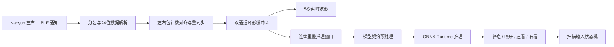

# BCI 扫描输入法

面向耳电（Ear-EEG）脑机接口的 Android 扫描输入原型。项目将双耳 BLE 数据采集、实时波形、ONNX 推理、T9 拼音扫描、候选字与词语预测，以及个性化数据上传训练整合在一个应用中。

当前应用以独立 `Activity` 运行，尚未声明 Android 系统级 `InputMethodService`，因此它是扫描输入交互原型，而不是可在其他 App 中直接调用的系统键盘。

仓库地址：[WoodenCatter/special_input_method](https://github.com/WoodenCatter/special_input_method)

## 主要功能

- T9 字母块扫描：`ABC`、`DEF`、`GHI`、`JKL`、`MNO`、`PQRS`、`TUV`、`WXYZ`。
- 拼音组合、候选汉字和预测词循环高亮。
- 左看、右看、咬牙三种控制信号；界面按钮也可用于无设备调试。
- Rime、本地语言模型和用户历史混合预测。
- Naoyun 双耳 BLE 设备扫描、连接、自动重连和数据流初始化。
- 500 Hz 双通道耳电接收、左右同包计数严格匹配、丢包重同步和诊断日志。
- 双通道 5 秒实时波形，固定量程 `-200～200 µV`。
- 可选择的绘图与推理预处理链。
- ONNX Runtime 端侧推理，支持个性化下载模型和内置回退模型。
- 四分类异步事件控制使用 75% 重叠滑窗、Session 校准、方向门控和动作去重。
- 最近 12 次模型实际输入波形回看，包含预测类别、概率和预处理说明。
- 分本地用户的连续 NPZ 采集、自动上传、服务器训练、ONNX 下载与启用。
- 同一份采集数据可训练多个模型，并自动启用验证准确率最高的有效模型。

## 系统链路



## 输入交互

应用默认扫描周期为 `1500 ms`，可在主界面调整。该参数只控制候选项的高亮停留时间，不改变异步 EEG 推理的窗口长度或步长。

| 阶段 | 左看 | 右看 | 咬牙 |
|---|---|---|---|
| 一级字母块 | 切到左侧，或选择左侧当前块 | 切到右侧，或选择右侧当前块 | 有拼音输入时进入拼音组合；否则进入常用语选择 |
| 拼音组合 | 高亮方向改为向左 | 高亮方向改为向右 | 确认当前拼音并进入候选字 |
| 候选字 | 高亮方向改为向左 | 高亮方向改为向右 | 确认当前汉字 |
| 预测词 | 高亮方向改为向左 | 高亮方向改为向右 | 确认当前预测词 |

预测结果按“用户历史 → 本地模型 → Rime 补充”的顺序合并、去重和排序。Debug 构建会显示预测链路诊断信息。

## BCI 设备与数据

当前 BLE 协议针对设备名包含 `Naoyun` 的双耳设备：

- 采样率：`500 Hz`。
- 每耳每包：`50` 个采样点。
- 理想速率：每耳约 `10 包/秒`。
- 数据通道：左耳、右耳。
- 数据精度：设备 24 位原始值转换为手机端浮点物理量。
- 包计数：无符号 8 位循环计数。

左右耳通知独立到达。`EegStereoPacketAligner` 仅发布左右计数完全相同的数据包，不使用 BLE 回调时间学习通道偏移。单耳丢包后会在下一个共同计数处立即恢复并开启新数据 epoch；采集时只废弃并重采受影响的当前动作，不终止整个 Session。日志会输出左右接收数、精确匹配数、重同步数、丢弃包数、待匹配包数、缺失包数及最后成对数据时间。

Android 12 及以上需要“附近的设备”权限；Android 11 及以下需要蓝牙和位置权限，部分系统还要求打开位置服务。

## 实时推理

耳电控制持续读取最新严格定长窗口，步长固定为模型窗口的 25%（75% 重叠）。模型结果经过 Session 活动量门槛、左右极性门控、强动作快速路径以及 `REST → POSSIBLE_ACTION → IN_ACTION → REFRACTORY` 事件状态机后才会生成命令。

推理使用 ONNX 元数据中的预处理契约、严格双通道点数和稳定 softmax。处理落后一个步长时会丢弃旧结果，避免执行过期信号。

四分类类别顺序固定为：

```text
0 = 静息
1 = 咬牙
2 = 左看
3 = 右看
```

六分类类别顺序固定为：

```text
0 = 静息
1 = 左看
2 = 右看
3 = 咬牙
4 = 左右
5 = 右左
```

每个采集 Session 会生成独立的 `async_calibration.json`。四分类保存方向与咬牙门槛；六分类还保存组合动作活动量、跨度门槛和左、右、左右、右左四路 64 点时序模板。模型切换时只加载协议、标签顺序、模型窗口及训练 Session 全部匹配的校准文件。

异步运行日志位于应用内部存储的 `files/bci_async_runs/`：每次运行包含 `run.json`、`windows.jsonl`、`events.jsonl`，事件还保存对应原始双通道 `.npy` 窗口。

### ONNX 约束

应用支持以下输入形状：

```text
(1, 2, N)
(1, 1, 2, N)
```

个性化模型下载后会校验：

- `algorithm` 与所选模型一致；
- `sample_rate_hz = 500`；
- `channels = 2`；
- `input_points` 与采集动作时长一致；
- `label_names = [rest, jaw, look_left, look_right]`；
- 预处理契约摘要一致；
- 输入适配器包含 `numpy-npz`；
- 可以完成一次零输入测试推理。

若没有有效的个性化活动模型，应用回退到 `app/src/main/assets/model.onnx`。

## 预处理

连接设备后可选择预处理；实时绘图和没有独立 ONNX 契约时的推理共享当前选择。个性化模型优先使用下载模型保存的推理契约。

| 预设 | 处理步骤 |
|---|---|
| 原始信号 | 不处理 |
| EEGNet | 1–45 Hz、二阶 Butterworth、零相位 `filtfilt` |
| CSANet | 0.1–40 Hz、四阶 Butterworth、零相位 `filtfilt`，随后逐通道 Z-score |
| 高级 | 可单独选择 0.1–40 Hz、Z-score 或 1–45 Hz + Z-score |

另外还提供 50 Hz 陷波、0.1–100 Hz 带通和去均值等界面可选步骤。

## 个性化采集与训练

### 用户与服务器绑定

- 本地用户可以离线创建，每个用户保存独立采集记录和模型。
- 一台设备绑定一组服务器账号，所有本地用户共用该绑定。
- 每位本地用户永久保存一个 `client_profile_id`；联网后通过幂等接口取得服务器 `profile_id`。
- 数据上传与训练任务都显式携带该 `profile_id`，后台任务会拒绝跨用户或跨 profile 上传。
- 发现服务器迁移的未关联历史 profile 时，可先在采集页将它人工关联到对应本地用户。
- API Key 使用 Android Keystore 的 AES-GCM 加密后保存在本机，不写入用户或会话 JSON。
- 默认服务地址为 `https://smu-brain.online`，定义在 `BrainApiClient.kt` 的 `BASE_URL`。

### 采集范式

每轮包含四类动作，顺序随机：

```text
静息 / 咬牙 / 左看 / 右看
```

默认流程为：

```text
准备1秒 → 显示“执行 + 动作” → 等待50ms完成绘制
→ 提示音与marker共同作为正式起点 → 执行动作 → 休息1秒
```

参数范围：

- 采集轮次：`1～100`；每轮每类各一次。
- 动作时长：`0.8～5.0 秒`。
- 训练轮次（epochs）：`1～50`，默认 `20`。
- 模型：可多选；每个模型可独立选择预处理预设。

正式开始前，应用使用 1 秒检测窗检查双耳配对流：连续两个窗口达到 `450～550 Hz` 才放行，最多等待 15 秒。

动作结束时必须实际收到：

```text
动作秒数 × 500
```

个双耳配对点。点数不足时该 marker 不写入数据集，当前动作自动重采；首次尝试后最多重采 10 次，仍不足则终止本次采集。打包前还会再次检查每个 marker 是否能生成完整模型窗口。

### 上传与训练

采集结果保存为连续双通道 NPZ：

```text
continuous.npz
├── left.npy
└── right.npy
```

marker、采样率、标签、模型窗口和预处理契约保存在会话 JSON 与上传 metadata 中。WorkManager 在有网络时自动完成：

```text
NPZ打包 → 上传数据集 → 创建训练任务 → 轮询训练状态
→ 下载ONNX → 本地校验 → 保存模型 → 自动启用最佳模型
```

同一份数据可训练 `wheelchair-eegnet`、`csanet` 等多个服务端模型。训练完成后，应用默认启用验证准确率最高且验证通过的模型，也可以手动切换。

模型管理支持删除成功或失败记录。删除操作只影响本地 ONNX、校验文件和关联采集数据，不删除服务器端数据或模型。

## 快速开始

### 环境要求

- Android Studio，建议使用其内置 JDK 17 或更高版本。
- Android SDK 36.1；最低支持 Android 7.0（API 24）。
- 支持 BLE 的 Android 设备。
- 如需 BCI：兼容当前 UUID 和数据格式的 Naoyun 双耳设备。
- 如需个性化训练：可访问配置的训练服务器并准备有效账号。

### 构建

Windows：

```powershell
.\gradlew.bat assembleDebug
.\gradlew.bat testDebugUnitTest
```

macOS / Linux：

```bash
./gradlew assembleDebug
./gradlew testDebugUnitTest
```

Debug APK 输出：

```text
app/build/outputs/apk/debug/app-debug.apk
```

使用 ADB 安装：

```powershell
adb install -r app\build\outputs\apk\debug\app-debug.apk
```

也可以直接在 Android Studio 中选择物理设备并运行 `app` 配置。

### 基本使用

1. 启动应用，在主页选择“输入法”“异步实时迷宫”或“设备状态”。
2. 首次使用先进入“设备状态”，授予蓝牙权限并扫描 Naoyun 设备。
3. 连接成功后确认左右耳均持续出波形；异步控制会自动加载匹配模型并启动，无需再点击控制按钮。
4. 返回主页后，左看或右看循环选择三个模块，咬牙进入当前模块。
5. 设备状态和采集管理页面会屏蔽BCI命令，但耳机连接、波形和采集保持运行。
6. 需要个性化训练时进入“采集管理”，选择四分类或六分类协议、模型和采集参数。
7. 输入法与迷宫均保留屏幕返回键，并支持 Android 系统返回。

## 项目结构

```text
app/src/main/java/com/example/input_ds/
├── bci/              BLE、数据解析、双耳对齐、预处理、ONNX和实时控制
├── data/             T9映射、拼音字典、语言模型和用户词典
├── engine/           拼音恢复、候选查询、本地/Rime混合预测
├── game/             四分类/六分类迷宫规则
├── model/            输入状态和控制信号模型
├── personalization/  用户、连续采集、NPZ、上传训练和模型管理
├── rime/             Rime数据部署
├── ui/               Compose界面、实时波形和采集界面
└── viewmodel/        扫描输入状态机

app/src/main/assets/
├── model.onnx        内置回退模型
├── pinyin_map.txt    拼音与汉字映射
├── bigrams.txt       二元语言模型
├── trigrams.txt      三元语言模型
└── rime_prediction/  Rime预测数据与配置
```

个性化数据位于应用内部存储的 `files/personalization/` 下。采集记录按本地用户保存在 `sessions/`，ONNX、校验文件和活动模型指针进一步按 `models/profiles/{profile_id}/` 隔离；切换本地用户时会同时切换其 profile 模型。旧版本直接保存在 `models/` 的文件会在首次取得 profile 后安全迁移。普通用户无需手动访问这些目录。

## 测试与调试

运行 JVM 单元测试：

```powershell
.\gradlew.bat testDebugUnitTest
```

当前测试覆盖：

- BLE 数据包解析与组包；
- 双耳包计数对齐、重同步与丢弃；
- 环形缓冲区和窗口重采样；
- 预处理链；
- BCI命令门控与采集epoch失效；
- 四分类和六分类异步动作检测；
- 四分类和六分类迷宫规则；
- Rime/本地预测文本处理；
- 采集速率与动作窗口验收策略；
- 采集参数边界；
- NumPy 兼容 NPZ 打包。

常用 Logcat 标签：

| 标签 | 内容 |
|---|---|
| `NaoyunBLE` | 扫描、连接、通知、包计数对齐和最后成对时间 |
| `BciController` | 连续重叠窗口、数据不足、命令执行与过期结果 |
| `ModelInference` | ONNX 路径、输入 shape、四/六类输出语义、概率和错误 |

示例：

```powershell
adb logcat -s NaoyunBLE:D BciController:D ModelInference:D
```

## 当前限制

- 不是系统级 Android IME，输出文本保留在应用界面内。
- BLE UUID、包格式、500 Hz 和每包 50 点目前针对 Naoyun 设备实现。
- 服务端地址是编译期常量，尚无环境切换界面。
- 正式 API v0.3.0 的模型目录未提供分类协议能力字段；启用的动态分类模型可直接使用四分类或六分类标签训练。手机以训练 Session 的精确 `label_names` 顺序校验下载的 ONNX。
- 训练与实时推理必须使用一致的模型窗口长度和预处理契约。
- Release 签名和正式发布流程尚未配置。

## 第三方组件与许可

项目使用 AndroidX、Jetpack Compose、ONNX Runtime、Rime/Trime 相关 native 组件等第三方依赖。归属与许可说明见 [THIRD_PARTY_NOTICES.md](THIRD_PARTY_NOTICES.md) 和 [LICENSES](LICENSES/)。
